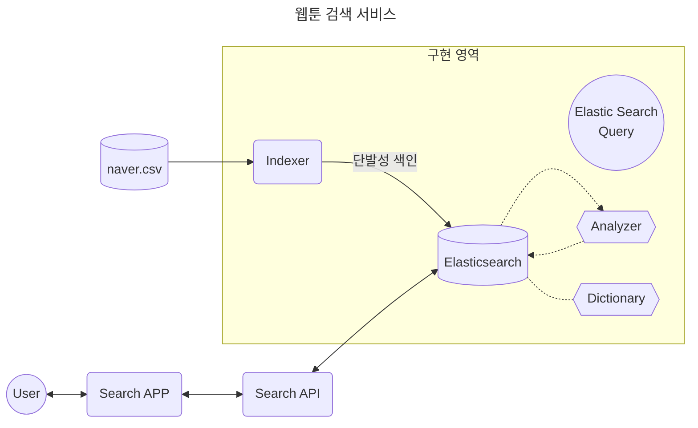

# Elasticsearch Side Project
* 목표
  * 연관도 검색을 구현한다.
    * TF-IDF, BM25 ...
  * 오타 교정 검색 결과를 질의한다.
    * analysis-icu, suggesters api ...
  * 사전을 통해 검색 키워드와 동의어를 갖는 검색 결과를 질의한다.

* 데이터
  * 캐글을 통해 찾아본다.
  * [네이버 웹툰 데이터셋](https://www.kaggle.com/datasets/bmofinnjake/naverwebtoon-datakorean)

